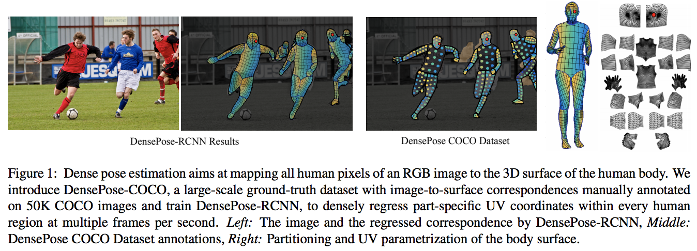
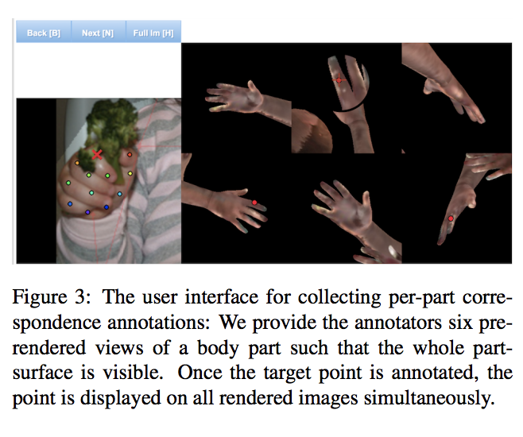
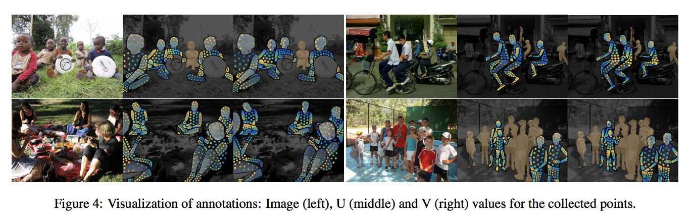
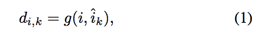
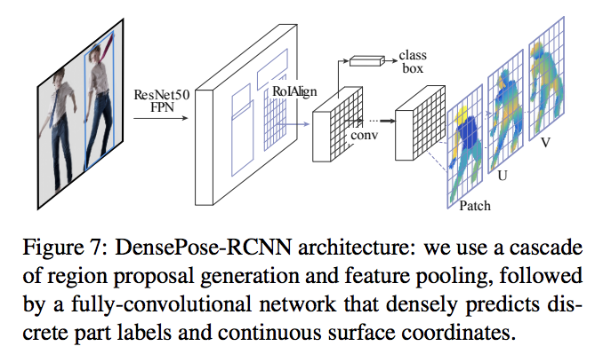
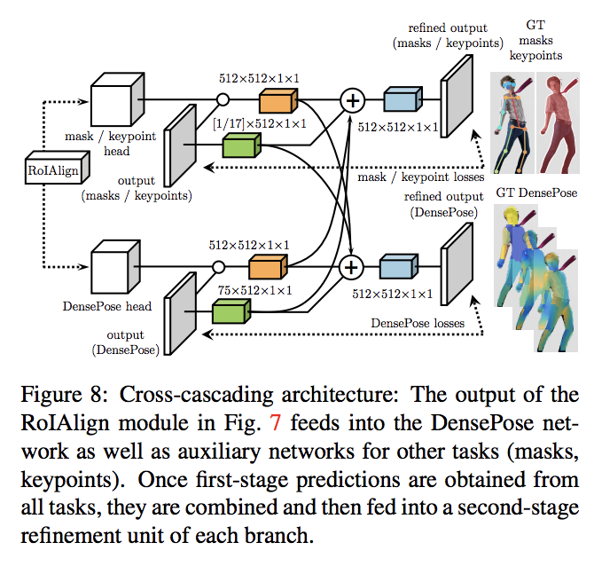
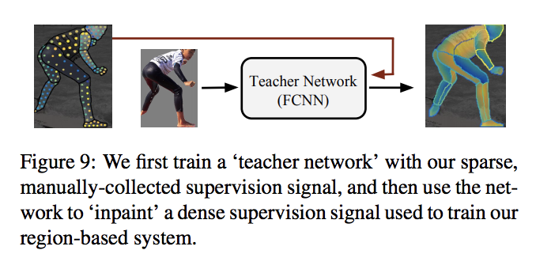
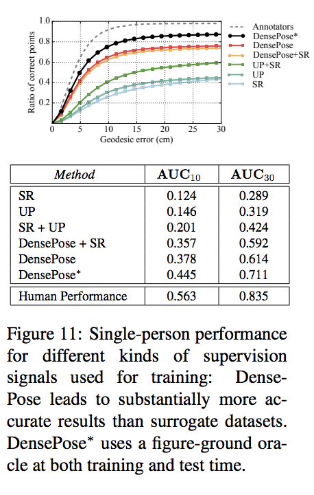
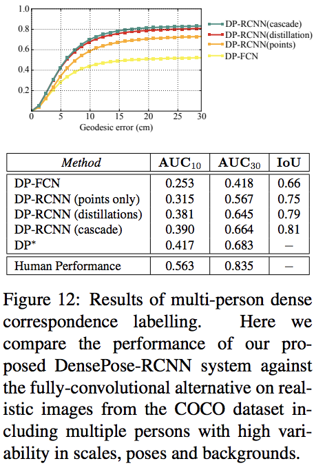
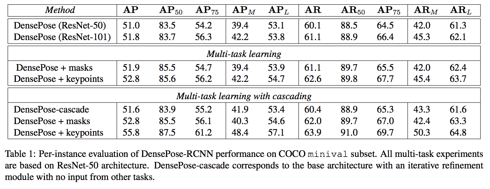

## 関連リンク
* [サイト](http://densepose.org/)  
* [ペーパー](https://arxiv.org/pdf/1802.00434.pdf)

## 研究成果
RGB画像から3dの人間の体のパーツをマッピングする

1. データセットをアップデートした（[27]のSMLPモデルとCOCOデータセット内の人物の密集共分散で作成）
1. CNNベースでのアーキテクチャの開発（[4,15]を取り入れている）
1. サブセットを使ったスパース調整

#### データセットのアップデート
アノテーションの体にいれるパイプラインを作った

セグメンテーションタスクとアノテーションのタスクを同時に走らせると制度が上がる

アノテーションの画像

評価方法
* point-wize

* pre-instance

#### 学習方法
DenseRegression[13]とMask-RCNN[15]を合わせたものでDensePose-RCNNと呼ぶことにした。
精度向上とスパースの補正もできる

###### Fully-convolutional dense pose回帰
分類とDenseRegに似た回帰を混ぜた

1. パートセグメンテーション：背景と人を認識する（普通のcross entropyで評価している）
1. ピクセルローカライゼーション：人間は24分割する+背景で全てで全25分割

###### Region-based Dense Pose回帰

`Fully-convolutional dense pose回帰`は簡単に学習できるが、タスクがかなり多くなってしまう
リージョンベースのアプローチ[34,15]、regions-of-interest（ROI）、region-adapted features through ROI pooling[16,15]を取り入れる
同時にend-to-end-manner[34]も取り入れる

実際のアーキテクチャでは、ResNet50FPN[15]からはじまり、Feature pyramid network[25]がある。
ROI-Align poolingをアーキテクチャの前に配置した。

全結合ネットワークをROI poolingの前にもってきた。
理由は、
1. 分類の生成
1. DenseRegの効率化に繋げる回帰ヘッドの追加

Mask-RCNNと全く同じアーキテクチャを使っている。
ストライドが8の3x3の全結合で、Reluレイヤーは512チャネルある。
GTX1080で320x240で25fps、800x1000で4-5fpsの処理をする。

###### Multi-task cascaded architectures

2つの手法でやっているため、パフォーマンスが向上した

###### Distillation-based ground-truth interpolation

一度ティーチャーネットワークを通してから学習をさせると精度があがる。
ティーチャーネットワークではスパース補正を行なったアノテーションだけ付与する。
一人の人に対して100〜150存在する。

## 評価

#### データセットの比較

1. [22]のデータで[27]の方法では分類に失敗することがある。
1. [43]のデータで[27]でやった方法が[28]だが、共変量シフト（与えられた入力に対する出力の生成規則は訓練時とテスト時で変わらないが、入力（共変量）の分布が訓練時とテストで変わる）が発生する。

両方ともSMLPモデルを使っているが、このペーパーも使っている。
UPデータセット8514枚のイメージと60kのSURREALモデルを比較のためにつかった。

ストライド8のResNet101FCNで別のデータセットでやった結果

#### FCNNとModelベースの比較

[2]のSMPLifyのパイプラインを使って[22]のコードを使って、[17]のDeeperCutで評価した。
figure10

#### Multi-Person Dense Poseへの応用の評価

#### 結果
* AR/APのマトリックス

## 関連研究

Depthセンサーを使ったアプローチ（インプットする画像が1つではない）[41,33,44]

精度が改善されてきた。
一般のカテゴリー分類[3,48,10,42,23,21]。

このペーパーは人間のカテゴリーにフォーカスしてる。

パラメトリックで変形可能なサーフェイスモデル[2,14,20]。

成熟した教師付き学習を行なった点では、上記とは異なる。

正確なパラメトリックサーフェイスモデルを採用した[27]。
[26,1,19,7,40,18,28]を発展させたもの。

マスクは[46,6,12]のものを使っているようだが、欠陥があるので、[43,22]を使った。

このペーパーは[13]と類似している。
精度をあげるためにアーキテクチャを変更した。
[15]を取り入れている。

GTX 1080 GPUで1秒間240x320の画像を20~26フレーム、800x1000の画像を4~5フレーム処理する。
