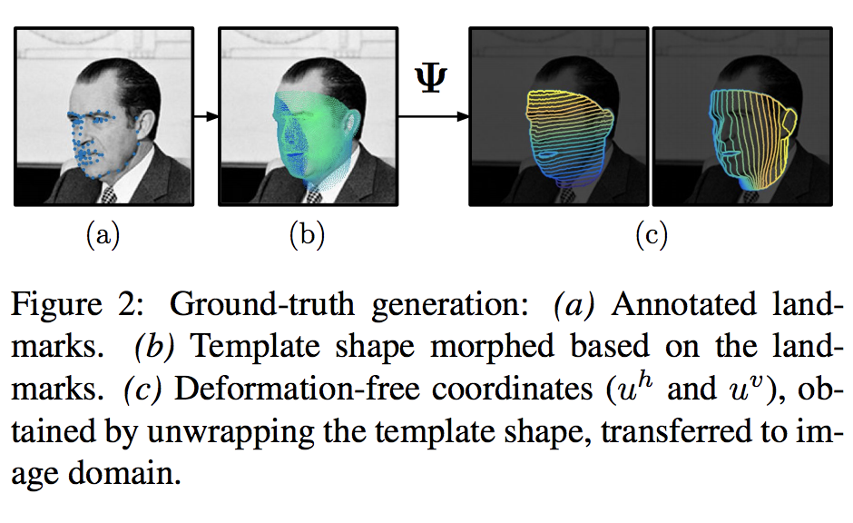
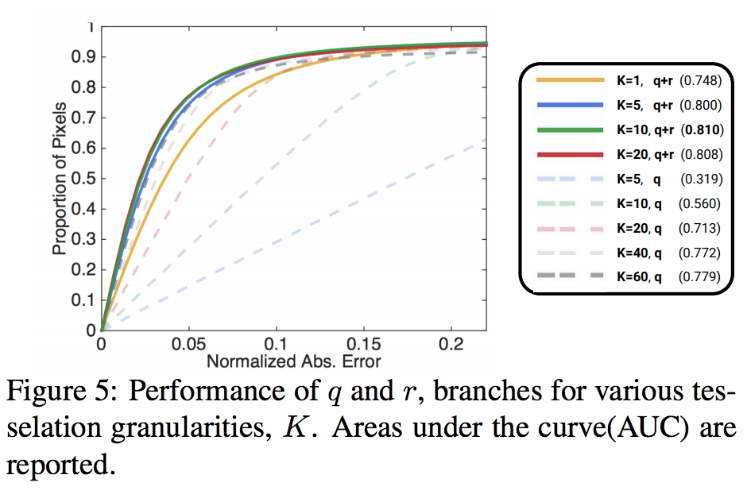

## 関連リンク

* [ペーパー](https://arxiv.org/pdf/1612.01202.pdf)
* [github](https://github.com/ralpguler/DenseReg)
* [project page](http://alpguler.com/DenseReg.html)

## 研究成果

イメージピクセルから全結合のネットワークを使って密集テンプレートグリッドを生成した
顔のパーツの分類にフォーカスしている
Statistical Deformable Modelsで初期化する state of the art の300Wのベンチマークで密度の共分散も取得することができた

[3]のcylindrical unwrappingで顔の表面を認識できるようになった
[55, 39]を使ったフィッテイング
[22,55]pixelごとのUVコーディネート

uhとhvの行列
垂直方向と、平行方向の2つの回帰を合成する
uhは、分断したqhと連続したrhを使う

d = 1/k 定量化のサイズ

uhとqhとrhの評価

qとrを使った方が良い結果がでた

顔は8つの部分に分ける

DeepLab-v2[11]と比較して分類の精度は向上した

### Landmark

landmark-matching[56]を併用することで精度が向上した

300Wのデータセットでの検証
state-of-the-artの検証にはMnemonic Descent Method (MDM) [44]を使った

### Tracking

300VWデータセットを使った[42,12]
検証方法はlandmarkと同じ

### 画像から3Dを予測する

### 体にも適用

### 耳にも適用

### 学習方法

#### トレーニング方法
3DDFAのデータ[55]を使ってトレーニングした
3DDFAデータをプロジェクションに3DMMモデルをBasel[35]に利用した
Face warehouse[7]を300W dataへ利用した

##### データセット
AFWの3148の画像を使って、[32]のout-of-the-box DPMの顔認識をつかった
スケーリングして一番大きいのは800px

##### CNNトレーニング
ResNet101[19]の拡大版[10,29]を使った
ストライドは8

（？）bilinear interpolation  
（？）quantizedとnon quantizedは何か？

データベースをあらかじめMS COCO segmentation task[27]でトレーニングしておいた
ガウシアン分布のレイヤーも追加しておいた
ラーニングレートは0.001
バッチサイズは10イメージで20k繰り返す
トレーニング中はスケーリングして最終的に切り取る

## 関連研究

このペーパー
画像の歪みを検知し、分類できるモデルを採用している -> 精度あげた
3Dテンプレートの代わりに、アノテーションを導入した
U-Vのパラメーターを使って、全結合のニューラルネットで訓練した
SDMsをin the wildという点と、共分散の精度という点で前進させた
主に人の顔にフォーカスしてタスクを作っている
SDMsの初期化できるようにした

今まで
歪みとかのパラメーターを固定していた -> このペーパーではmaxpoolingで分類している

* [33]と似ている変換をしている
* 正確ではないが検知するもの[20, 18, 9]
* [24, 36]フィードフォーワードに取り入れている
* [31, 4]3Dのもの
* RGBDのイメージから体を検出する[43, 37, 49]
* [10]in the wildな分類

統計的な手法
Stastical Deformable Models(SDMs)、Active Appearance Model(AAMs)、3D Morphable Models(3DMMs)などがある。 
* [40]ランドマークロケーション
* [22]3dのin the wildの顔認識
* [44]反復問題の解決
SDMsの問題点
  * 外部のシステムから初期化しなくてはいけない -> このペーパーで解決
  * 反復問題 -> Deep Learningで解決済み

